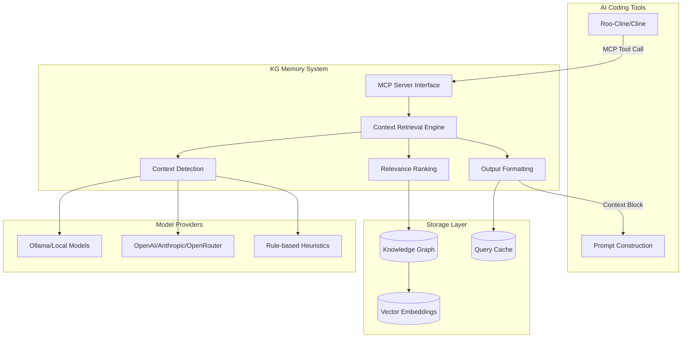

# Design Document

## Overview

The Knowledge Graph Memory system is designed as an intelligent context retrieval system built as a fork of the open-source Memory MCP Server (https://github.com/modelcontextprotocol/servers/tree/main/src/memory) with domain-specific extensions for AI coding assistants. The system uses a three-layer architecture: a knowledge graph storage layer, an intelligent retrieval engine, and an MCP-based integration layer that seamlessly connects with coding tools like Roo-Cline and Cline.

By forking the existing Memory MCP Server, we inherit its robust SQLite-based graph database, vector embeddings support, and MCP protocol implementation while adding specialized capabilities for software development contexts. The core innovation lies in the combination of semantic search with domain-aware ranking algorithms that understand architectural layers, rule priorities, and coding task contexts.

## Architecture

### High-Level Architecture



### Component Architecture

The system follows a modular design with clear separation of concerns:

**1. MCP Interface Layer**
- Exposes three primary tools: `query_directives`, `detect_context`, `upsert_markdown`
- Handles request validation and response formatting
- Manages error handling and fallback scenarios

**2. Context Retrieval Engine**
- Orchestrates the entire retrieval pipeline
- Manages model provider selection and fallback logic
- Implements caching strategies for performance

**3. Knowledge Graph Storage**
- Built on forked Memory MCP Server's SQLite-based graph database
- Extends existing schema with rules, directives, and relationships tables
- Leverages existing vector embeddings infrastructure for semantic search

**4. Model Provider Abstraction**
- Unified interface for local and cloud model providers
- Automatic fallback to rule-based detection when models unavailable
- Configurable provider selection and API key management

## Components and Interfaces

### Core Components

#### 1. MCP Server Fork Extensions

**Interface**: Adds three new domain-specific tools to the forked Memory MCP Server

```typescript
interface MCPTools {
  // Primary interface for coding assistants
  "memory.rules.query_directives": {
    input: {
      taskDescription: string;
      modeSlug?: "architect" | "code" | "debug";
      options?: {
        strictLayer?: boolean;
        maxItems?: number;
        tokenBudget?: number;
        includeBreadcrumbs?: boolean;
      };
    };
    output: {
      context_block: string;
      citations: Citation[];
      diagnostics: QueryDiagnostics;
    };
  };

  // Standalone context detection
  "memory.rules.detect_context": {
    input: {
      text: string;
      options?: { returnKeywords?: boolean };
    };
    output: {
      detectedLayer: ArchitecturalLayer;
      topics: string[];
      keywords?: string[];
      confidence: number;
    };
  };

  // Rule ingestion from markdown
  "memory.rules.upsert_markdown": {
    input: {
      documents: { path: string }[];
      options?: { overwrite?: boolean };
    };
    output: {
      upserted: IngestionStats;
      relations: number;
      warnings: string[];
    };
  };
}
```

#### 2. Context Detection Engine

**Responsibility**: Analyze task descriptions to identify architectural context

```typescript
interface ContextDetectionEngine {
  detectContext(text: string, options?: DetectionOptions): Promise<TaskContext>;
  
  // Layer detection using pattern matching and ML
  detectArchitecturalLayer(text: string): Promise<{
    layer: ArchitecturalLayer;
    confidence: number;
    indicators: string[];
  }>;
  
  // Topic extraction using NLP and domain dictionaries
  extractTopics(text: string): Promise<{
    topics: string[];
    keywords: string[];
    technologies: string[];
  }>;
}

type ArchitecturalLayer = 
  | "1-Presentation" 
  | "2-Application" 
  | "3-Domain" 
  | "4-Persistence" 
  | "5-Infrastructure" 
  | "*";

interface TaskContext {
  layer: ArchitecturalLayer;
  topics: string[];
  keywords: string[];
  technologies: string[];
  confidence: number;
}
```

**Detection Strategies**:

1. **Rule-based Pattern Matching** (Fallback, always available)
   - Keyword dictionaries for each layer
   - Technology-specific indicators
   - Action verb analysis (create, update, deploy, etc.)

2. **Local Model Analysis** (Optional, via Ollama)
   - Small language models for classification
   - Privacy-preserving, no external API calls
   - Configurable model selection

3. **Cloud Model Analysis** (Optional, configurable)
   - OpenAI GPT models for high accuracy
   - Anthropic Claude for nuanced understanding
   - OpenRouter for model variety
   - OpenAI-compatible APIs for flexibility

#### 3. Relevance Ranking Engine

**Responsibility**: Score and rank directives based on task context

```typescript
interface RankingEngine {
  rankDirectives(
    candidates: Directive[], 
    context: TaskContext, 
    options: RankingOptions
  ): Promise<RankedDirective[]>;
}

interface RankingAlgorithm {
  // Weighted scoring model
  calculateScore(directive: Directive, context: TaskContext): number;
  
  // Individual scoring components
  authorityScore(directive: Directive, topics: string[]): number;
  layerMatchScore(directive: Directive, layer: ArchitecturalLayer): number;
  topicOverlapScore(directive: Directive, topics: string[]): number;
  severityBoost(severity: "MUST" | "SHOULD" | "MAY"): number;
  semanticSimilarity(directive: Directive, taskText: string): number;
  whenToApplyScore(directive: Directive, keywords: string[]): number;
}
```

**Scoring Formula**:
```
Score = (Authority × 10) + (WhenToApply × 8) + (LayerMatch × 7) + 
        (TopicOverlap × 5) + (SeverityBoost × 4) + (SemanticSim × 3)
```

#### 4. Knowledge Graph Schema

**Entities**:

```typescript
interface Rule {
  id: string;
  name: string;
  layer: ArchitecturalLayer;
  authoritativeFor: string[];
  topics: string[];
  sourcePath: string;
  lastUpdated: Date;
}

interface Directive {
  id: string;
  ruleId: string;
  section: string;
  severity: "MUST" | "SHOULD" | "MAY";
  text: string;
  rationale?: string;
  example?: string;
  antiPattern?: string;
  topics: string[];
  whenToApply: string[];
  embedding?: number[];
}

interface Relationship {
  from: string;
  to: string;
  type: "CONTAINS" | "AUTHORITATIVE_FOR" | "APPLIES_TO" | "RELATED_TO";
  weight?: number;
}
```

#### 5. Model Provider Abstraction

**Interface**: Unified abstraction for different model providers

```typescript
interface ModelProvider {
  name: string;
  type: "local" | "cloud";
  isAvailable(): Promise<boolean>;
  detectContext(text: string): Promise<TaskContext>;
  generateEmbedding(text: string): Promise<number[]>;
}

class OllamaProvider implements ModelProvider {
  // Local model integration via Ollama API
}

class OpenAIProvider implements ModelProvider {
  // OpenAI API integration
}

class AnthropicProvider implements ModelProvider {
  // Anthropic Claude API integration
}

class OpenRouterProvider implements ModelProvider {
  // OpenRouter API integration
}

class RuleBasedProvider implements ModelProvider {
  // Fallback heuristic-based detection
}
```

### Data Models

#### Rule Document Structure

Rules are stored as structured markdown documents following this schema:

```markdown
# [Rule Name]

## Metadata
- **Layer**: 1-Presentation | 2-Application | 3-Domain | 4-Persistence | 5-Infrastructure | *
- **AuthoritativeFor**: [security, testing, architecture]
- **Topics**: [API, validation, authentication, performance]

## When to Apply
- Creating new API endpoints
- Handling user input
- Implementing authentication flows

## Directives

### [Section Name]
**[MUST|SHOULD|MAY]** [Directive text]

**Rationale**: [Why this directive exists]

**Example**: [Code example showing correct implementation]

**Anti-pattern**: [Code example showing what to avoid]
```

#### Graph Storage Schema

The knowledge graph extends the forked Memory MCP Server's existing schema with additional tables:

```sql
-- Extended tables for rule-specific entities
CREATE TABLE rules (
  id TEXT PRIMARY KEY,
  name TEXT NOT NULL,
  layer TEXT NOT NULL,
  authoritative_for TEXT, -- JSON array
  topics TEXT,           -- JSON array
  source_path TEXT,
  created_at DATETIME,
  updated_at DATETIME
);

CREATE TABLE directives (
  id TEXT PRIMARY KEY,
  rule_id TEXT REFERENCES rules(id),
  section TEXT NOT NULL,
  severity TEXT CHECK(severity IN ('MUST', 'SHOULD', 'MAY')),
  text TEXT NOT NULL,
  rationale TEXT,
  example TEXT,
  anti_pattern TEXT,
  topics TEXT,           -- JSON array
  when_to_apply TEXT,    -- JSON array
  embedding BLOB,        -- Vector embedding
  created_at DATETIME
);

CREATE TABLE rule_relationships (
  id TEXT PRIMARY KEY,
  from_id TEXT NOT NULL,
  to_id TEXT NOT NULL,
  relationship_type TEXT NOT NULL,
  weight REAL DEFAULT 1.0,
  created_at DATETIME
);

-- Indexes for performance
CREATE INDEX idx_directives_rule_id ON directives(rule_id);
CREATE INDEX idx_directives_severity ON directives(severity);
CREATE INDEX idx_directives_topics ON directives(topics);
CREATE INDEX idx_rules_layer ON rules(layer);
CREATE INDEX idx_rules_topics ON rules(topics);
```

## Error Handling

### Graceful Degradation Strategy

The system implements multiple fallback levels to ensure reliability:

**Level 1: Full Functionality**
- Model provider available
- Knowledge graph populated
- All features operational

**Level 2: Rule-based Fallback**
- Model provider unavailable
- Context detection via heuristics
- Reduced accuracy but functional

**Level 3: Static Baseline**
- Knowledge graph unavailable
- Return predefined core rules
- Minimal but safe guidance

**Level 4: Transparent Failure**
- System completely unavailable
- Return empty context with clear error message
- Coding assistant continues without context

### Error Types and Handling

```typescript
enum ErrorType {
  MODEL_PROVIDER_UNAVAILABLE = "model_provider_unavailable",
  KNOWLEDGE_GRAPH_UNAVAILABLE = "knowledge_graph_unavailable", 
  INVALID_RULE_FORMAT = "invalid_rule_format",
  QUERY_TIMEOUT = "query_timeout",
  INSUFFICIENT_CONTEXT = "insufficient_context"
}

interface ErrorResponse {
  error: ErrorType;
  message: string;
  fallbackUsed: boolean;
  suggestions?: string[];
}
```

### Performance Safeguards

- **Query Timeout**: 400ms hard limit with graceful degradation
- **Token Budget Enforcement**: Hard caps to prevent oversized responses
- **Cache Warming**: Pre-compute common query patterns
- **Circuit Breaker**: Disable expensive operations under load

## Testing Strategy

### Unit Testing

**Context Detection Engine**
- Test layer detection accuracy across diverse task descriptions
- Validate topic extraction with domain-specific vocabulary
- Test fallback behavior when models unavailable

**Ranking Algorithm**
- Test scoring components individually
- Validate ranking consistency across similar tasks
- Test edge cases (no rules, conflicting rules, etc.)

**Model Provider Abstraction**
- Mock different provider responses
- Test fallback chain behavior
- Validate API error handling

### Integration Testing

**End-to-End Query Flow**
- Test complete pipeline from task description to formatted output
- Validate MCP tool integration
- Test performance under various load conditions

**Knowledge Graph Operations**
- Test rule ingestion from markdown documents
- Validate relationship creation and querying
- Test incremental updates and conflict resolution

### Performance Testing

**Query Latency**
- Target: <400ms for 95th percentile
- Test with knowledge graphs of varying sizes (10-1000 rules)
- Measure impact of different model providers

**Token Efficiency**
- Measure token reduction vs baseline approaches
- Validate context quality doesn't degrade with compression
- Test token budget enforcement accuracy

### Accuracy Testing

**Context Detection Accuracy**
- Target: >80% layer detection accuracy
- Target: >75% topic identification accuracy
- Test across multiple programming languages and frameworks

**Relevance Scoring**
- Manual evaluation of top-ranked directives
- A/B testing of different ranking weights
- Feedback loop for continuous improvement

### Cross-Platform Testing

**Operating System Compatibility**
- Windows (PowerShell, CMD)
- macOS (Bash, Zsh)
- Linux (Bash, various distributions)

**Model Provider Integration**
- Local: Ollama on different platforms
- Cloud: API compatibility across providers
- Fallback: Rule-based detection consistency

## Platform-Specific Considerations

### Windows Support
- PowerShell and CMD compatibility
- Windows path handling for rule documents
- Windows-specific dependency management

### macOS Support  
- Homebrew integration for dependencies
- macOS-specific file system considerations
- Apple Silicon compatibility for local models

### Linux Support
- Package manager agnostic installation
- Container deployment options
- Various distribution compatibility

### Model Provider Configuration

**Local Models (Ollama)**
```json
{
  "modelProvider": {
    "type": "local",
    "provider": "ollama",
    "config": {
      "baseUrl": "http://localhost:11434",
      "model": "llama2:7b",
      "timeout": 5000
    }
  }
}
```

**Cloud Models (OpenAI)**
```json
{
  "modelProvider": {
    "type": "cloud", 
    "provider": "openai",
    "config": {
      "apiKey": "${OPENAI_API_KEY}",
      "model": "gpt-3.5-turbo",
      "timeout": 3000
    }
  }
}
```

**Fallback Configuration**
```json
{
  "modelProvider": {
    "type": "rule-based",
    "config": {
      "layerKeywords": {
        "1-Presentation": ["UI", "component", "React", "CSS"],
        "4-Persistence": ["database", "SQL", "repository"]
      }
    }
  }
}
```

This design provides a robust, scalable foundation for the Knowledge Graph Memory system that addresses all requirements while maintaining flexibility for different deployment scenarios and user preferences.