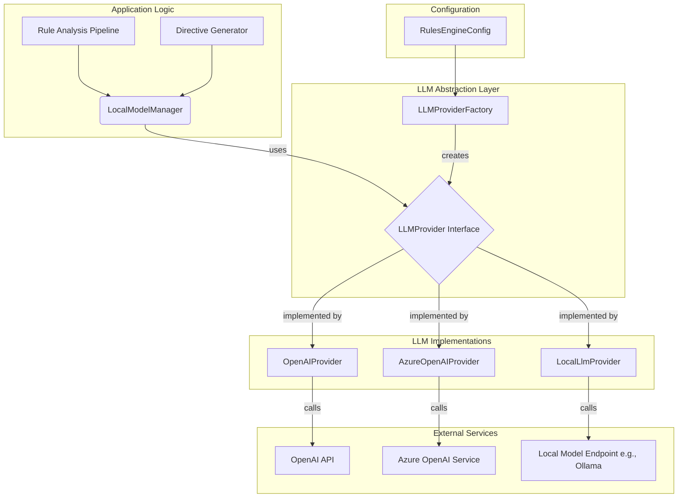

# Architectural Design: Intelligent Rule Ingestion System

## 1. Overview

This document outlines the architecture for an intelligent rule ingestion system. The system enhances the existing rule processing workflow by integrating a Large Language Model (LLM) to automatically split large, multi-concern rule documents and generate actionable directives (`[MUST]`, `[SHOULD]`, `[MAY]`) from content that lacks them.

The design prioritizes flexibility, resilience, and backward compatibility. It introduces a provider-agnostic LLM abstraction layer, an intelligent analysis pipeline, and robust error handling, all while integrating seamlessly into the existing `RuleManager` architecture.

## 2. LLM Integration Architecture

The foundation of the new system is a flexible architecture for communicating with various LLM providers.

### 2.1. Core Components

-   **`LLMProvider` Interface**: A common interface defining the contract for all LLM clients, ensuring consistent interaction for text and structured JSON generation.
-   **`LLMProviderFactory`**: A factory that instantiates the correct `LLMProvider` (e.g., `OpenAIProvider`, `AzureOpenAIProvider`, `LocalLlmProvider`) based on the application's configuration.
-   **`LocalModelManager`**: The central service that orchestrates all LLM interactions, handling configuration, provider instantiation, and high-level tasks like executing prompts with retry logic.
-   **`RulesEngineConfig`**: A dedicated configuration schema for managing LLM endpoints, API keys, and rule processing behavior.

### 2.2. Architectural Diagram



## 3. Rule Analysis & Splitting Pipeline

This pipeline intelligently decides if a single markdown file should be split into multiple `Rule` nodes in the knowledge graph. It is orchestrated by a new `RuleAnalyzer` class.

### 3.1. Pipeline Stages

1.  **Pre-analysis**: The pipeline first performs cheap checks. It bypasses the LLM for documents that are too short or have `split: false` in their frontmatter.
2.  **LLM-based Analysis**: For eligible documents, the content is sent to the LLM, which is prompted to identify distinct conceptual "concerns" and return a structured JSON object detailing its findings.
3.  **Splitting Decision**: The `RuleAnalyzer` uses the LLM's response (e.g., `shouldSplit: true` and `concerns.length > 1`) to make a final decision.
4.  **Content Segmentation**: If a split is approved, the original markdown is divided into smaller, self-contained markdown strings, one for each new sub-rule. Each new document inherits and augments the original's metadata.
5.  **Output**: The pipeline outputs an array of one or more document structures, ready for processing by the next stage.

## 4. Directive Generation Strategy

This strategy enhances the existing `DirectiveExtractor` (to be renamed `DirectiveProcessor`) to automatically generate directives when they are missing.

### 4.1. Workflow

-   **Preserve Existing**: The `DirectiveProcessor` first scans a markdown section for explicit, well-formatted directives (`[MUST]`, etc.). If found, these are preserved, and no generation occurs for that section.
-   **Generate Missing**: If no explicit directives are found and the section content is substantial, the processor invokes the `LocalModelManager`. The LLM is prompted to generate a set of directives, assign a severity (`MUST`, `SHOULD`, `MAY`), and provide a justification.
-   **Traceability**: Generated directives will be flagged (e.g., `isGenerated: true`) to maintain traceability back to their source and distinguish them from human-authored directives.

## 5. API Interfaces & Configuration

The following data contracts and configuration files will be created or modified.

### 5.1. Configuration Schema (`src/config/rules-engine-config.ts`)

A new `RulesEngineConfigSchema` will centralize all settings for the new system.

```typescript
// src/config/rules-engine-config.ts
import { z } from 'zod';

const LlmConfigSchema = z.object({
  provider: z.enum(['openai', 'azure_openai', 'local']).default('local'),
  endpoint: z.string().url(),
  apiKey: z.string().optional(),
  model: z.string(),
  // ... other LLM settings
});

const RuleProcessingConfigSchema = z.object({
  enableSplitting: z.boolean().default(true),
  minWordCountForSplit: z.number().int().positive().default(250),
  enableDirectiveGeneration: z.boolean().default(true),
  minWordCountForGeneration: z.number().int().positive().default(100),
});

export const RulesEngineConfigSchema = z.object({
  llm: LlmConfigSchema,
  processing: RuleProcessingConfigSchema,
});

export type RulesEngineConfig = z.infer<typeof RulesEngineConfigSchema>;
```

### 5.2. Core Interfaces (`src/rules/llm-provider.ts`)

```typescript
// src/rules/llm-provider.ts
export interface LLMProvider {
  generateJson<T>(prompt: string, schema: z.ZodType<T>, options?: LLMGenerationOptions): Promise<LLMJsonResponse<T>>;
  generateText(prompt: string, options?: LLMGenerationOptions): Promise<string>;
}
```

## 6. Error Handling & Resilience

-   **Graceful Degradation**: The system is designed to function without the LLM. If LLM calls fail or are disabled via the configuration (`enableSplitting: false`), the system will revert to its original behavior of one rule per file and only processing explicit directives.
-   **Retry Logic**: The `LocalModelManager` will implement a retry mechanism with exponential backoff for transient network errors and timeouts.
-   **Validation & Fallback**: All LLM responses for structured JSON are validated against a Zod schema. If validation fails, the operation is aborted for that specific task (e.g., splitting is skipped), a warning is logged, and the pipeline continues gracefully.

## 7. Integration Points

The new system will be integrated into the existing `upsert_markdown` workflow.

1.  **`RuleManager` Constructor**: Will be updated to accept the `RulesEngineConfig` and initialize the `LocalModelManager`, `RuleAnalyzer`, and `DirectiveProcessor`.
2.  **`upsertMarkdown` Method**: This method in `src/rules/rule-manager.ts` will be refactored to orchestrate the new pipeline:
    -   It will first call the `RuleAnalyzer` to get a list of one or more documents.
    -   It will then loop through each document.
    -   Inside the loop, it will use the `DirectiveProcessor` to extract or generate directives.
    -   The existing `GraphBuilder` will then be called for each document to create the corresponding graph structure.
3.  **File Renaming**: `src/parsing/directive-extractor.ts` will be renamed to `src/parsing/directive-processor.ts`, and the class within will be updated.