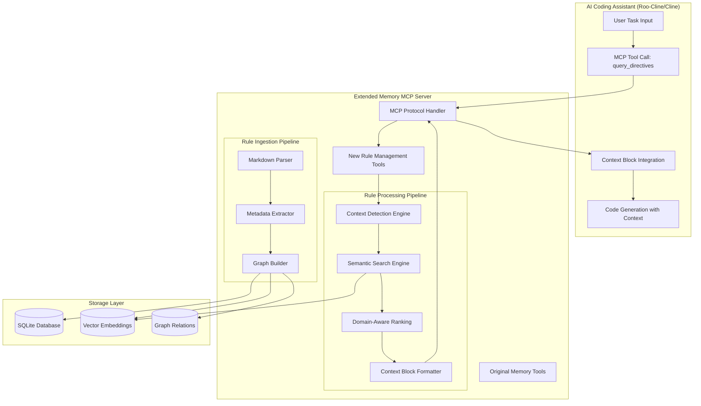

# Design Document

## Overview

This design document outlines the technical architecture for extending the existing Memory MCP server with knowledge graph-based rule management capabilities. The solution creates a unified MCP server that provides both the original memory functionality and new rule-specific tools for AI coding assistants.

The system addresses the core challenge of providing relevant, contextual project rules to AI coding assistants while staying within token limits. By implementing semantic search combined with domain-specific ranking, we can reduce context token usage by 70-85% while improving relevance from 30-40% to 85-95%.

## Architecture

### High-Level System Architecture



### Component Integration Strategy

The design extends the existing Memory MCP server rather than creating a separate service:

1. **Fork Approach**: Start with the existing Memory MCP server codebase as the foundation
2. **Additive Extensions**: Add new rule-specific modules without modifying core memory functionality
3. **Unified Interface**: Expose both original memory tools and new rule tools through the same MCP server
4. **Backward Compatibility**: Ensure existing Memory MCP clients continue to work unchanged

## Components and Interfaces

### 1. MCP Tool Interface Layer

The system exposes three new MCP tools alongside the existing memory tools:

#### A. memory.rules.query_directives

**Purpose**: Primary interface for retrieving contextually relevant rules

**Input Schema**:
```typescript
interface QueryDirectivesInput {
  taskDescription: string;           // Required: The coding task description
  modeSlug?: 'architect' | 'code' | 'debug';  // Optional: Context mode
  options?: {
    strictLayer?: boolean;           // Enforce layer-specific filtering
    maxItems?: number;              // Maximum directives to return (default: 8)
    tokenBudget?: number;           // Soft token limit (default: 1000)
    includeBreadcrumbs?: boolean;   // Include source citations
    severityFilter?: ('MUST' | 'SHOULD' | 'MAY')[];  // Filter by severity
  };
}
```

**Output Schema**:
```typescript
interface QueryDirectivesOutput {
  context_block: string;            // Formatted markdown context
  citations: Citation[];            // Source references
  diagnostics: {
    detectedLayer: string;
    topics: string[];
    retrievalStats: {
      searched: number;
      considered: number;
      selected: number;
    };
  };
}
```

#### B. memory.rules.detect_context

**Purpose**: Standalone context detection for testing and advanced scenarios

**Input Schema**:
```typescript
interface DetectContextInput {
  text: string;                     // Text to analyze
  options?: {
    returnKeywords?: boolean;       // Include extracted keywords
    confidenceThreshold?: number;  // Minimum confidence (0-1)
  };
}
```

**Output Schema**:
```typescript
interface DetectContextOutput {
  detectedLayer: string;
  topics: string[];
  keywords?: string[];
  confidence: number;
  alternativeContexts?: Array<{
    layer: string;
    topics: string[];
    confidence: number;
  }>;
}
```

#### C. memory.rules.upsert_markdown

**Purpose**: Batch ingestion of markdown rule documents

**Input Schema**:
```typescript
interface UpsertMarkdownInput {
  documents: Array<{
    path: string;                   // File path to markdown document
    content?: string;               // Optional: direct content instead of file
  }>;
  options?: {
    overwrite?: boolean;            // Replace existing rules
    validateOnly?: boolean;         // Parse but don't store
  };
}
```

**Output Schema**:
```typescript
interface UpsertMarkdownOutput {
  upserted: {
    rules: number;
    sections: number;
    directives: number;
    patterns: number;
  };
  relations: number;
  warnings: string[];
  errors: string[];
}
```

### 2. Context Detection Engine

The context detection engine analyzes task descriptions to identify relevant architectural layers, topics, and technologies. It supports both local model integration for enhanced accuracy and rule-based fallback for reliability.

#### Multi-Modal Detection Strategy

```typescript
interface DetectionStrategy {
  primary: 'local-model' | 'rule-based';
  fallback: 'rule-based';
  localModelConfig?: {
    endpoint: string;        // e.g., 'http://localhost:11434' for Ollama
    model: string;          // e.g., 'llama3.2:3b'
    timeout: number;        // Request timeout in ms
  };
}
```

#### Local Model Integration

The system integrates with local AI models via HTTP API for enhanced context detection:

```typescript
class LocalModelDetector {
  constructor(private config: LocalModelConfig) {}

  async detectContext(taskDescription: string): Promise<DetectedContext> {
    try {
      const prompt = this.buildStructuredPrompt(taskDescription);
      const response = await this.callLocalModel(prompt);
      return this.parseModelResponse(response);
    } catch (error) {
      console.warn('Local model detection failed, falling back to rule-based:', error.message);
      return this.fallbackDetector.detectContext(taskDescription);
    }
  }

  private buildStructuredPrompt(taskDescription: string): string {
    return `Analyze this software development task and extract context information.

Task: "${taskDescription}"

Respond with JSON in this exact format:
{
  "layer": "1-Presentation|2-Application|3-Domain|4-Persistence|5-Tests|6-Docs|7-Deployment",
  "topics": ["security", "testing", "performance", "api", "database", "frontend", "backend"],
  "technologies": ["React", "C#", ".NET", "SQL", "TypeScript", "Azure"],
  "keywords": ["login", "button", "endpoint", "validation"],
  "confidence": 0.85
}

Layer definitions:
- 1-Presentation: UI components, pages, styling, user interface
- 2-Application: Business logic, services, workflows, orchestration  
- 3-Domain: Entities, business rules, domain models, aggregates
- 4-Persistence: Database, repositories, queries, data access
- 5-Tests: Unit tests, integration tests, test automation
- 6-Docs: Documentation, diagrams, specifications
- 7-Deployment: Infrastructure, CI/CD, monitoring, deployment

Extract only topics that are clearly relevant. Be conservative with confidence scores.`;
  }

  private async callLocalModel(prompt: string): Promise<string> {
    const controller = new AbortController();
    const timeoutId = setTimeout(() => controller.abort(), this.config.timeout);

    try {
      // Ollama API format
      const response = await fetch(`${this.config.endpoint}/api/generate`, {
        method: 'POST',
        headers: { 'Content-Type': 'application/json' },
        body: JSON.stringify({
          model: this.config.model,
          prompt: prompt,
          stream: false,
          options: {
            temperature: 0.1,  // Low temperature for consistent structured output
            top_p: 0.9
          }
        }),
        signal: controller.signal
      });

      if (!response.ok) {
        throw new Error(`HTTP ${response.status}: ${response.statusText}`);
      }

      const data = await response.json();
      return data.response;
    } finally {
      clearTimeout(timeoutId);
    }
  }

  private parseModelResponse(response: string): DetectedContext {
    try {
      // Extract JSON from response (handle cases where model adds extra text)
      const jsonMatch = response.match(/\{[\s\S]*\}/);
      if (!jsonMatch) {
        throw new Error('No JSON found in model response');
      }

      const parsed = JSON.parse(jsonMatch[0]);
      
      // Validate required fields
      if (!parsed.layer || !Array.isArray(parsed.topics)) {
        throw new Error('Invalid response format from local model');
      }

      return {
        layer: parsed.layer,
        topics: parsed.topics || [],
        technologies: parsed.technologies || [],
        keywords: parsed.keywords || [],
        confidence: Math.min(Math.max(parsed.confidence || 0.5, 0), 1)
      };
    } catch (error) {
      throw new Error(`Failed to parse model response: ${error.message}`);
    }
  }
}
```

#### Cross-Platform Local Model Support

The system supports multiple local model providers across Windows and macOS:

```typescript
interface LocalModelProvider {
  name: string;
  defaultEndpoint: string;
  healthCheck: () => Promise<boolean>;
  isAvailable: () => Promise<boolean>;
}

class LocalModelManager {
  private providers: LocalModelProvider[] = [
    {
      name: 'Ollama',
      defaultEndpoint: 'http://localhost:11434',
      healthCheck: async () => {
        try {
          const response = await fetch('http://localhost:11434/api/tags');
          return response.ok;
        } catch {
          return false;
        }
      },
      isAvailable: async () => {
        // Check if Ollama is installed and running
        return this.healthCheck();
      }
    },
    {
      name: 'LocalAI',
      defaultEndpoint: 'http://localhost:8080',
      healthCheck: async () => {
        try {
          const response = await fetch('http://localhost:8080/v1/models');
          return response.ok;
        } catch {
          return false;
        }
      },
      isAvailable: async () => {
        return this.healthCheck();
      }
    },
    {
      name: 'LM Studio',
      defaultEndpoint: 'http://localhost:1234',
      healthCheck: async () => {
        try {
          const response = await fetch('http://localhost:1234/v1/models');
          return response.ok;
        } catch {
          return false;
        }
      },
      isAvailable: async () => {
        return this.healthCheck();
      }
    }
  ];

  async detectAvailableProvider(): Promise<LocalModelProvider | null> {
    for (const provider of this.providers) {
      if (await provider.isAvailable()) {
        return provider;
      }
    }
    return null;
  }

  async autoConfigureLocalModel(): Promise<LocalModelConfig | null> {
    const provider = await this.detectAvailableProvider();
    if (!provider) {
      return null;
    }

    // Try to get available models
    const models = await this.getAvailableModels(provider.defaultEndpoint);
    const preferredModel = this.selectBestModel(models);

    return {
      endpoint: provider.defaultEndpoint,
      model: preferredModel,
      timeout: 5000,
      provider: provider.name
    };
  }

  private async getAvailableModels(endpoint: string): Promise<string[]> {
    try {
      // Try Ollama format first
      let response = await fetch(`${endpoint}/api/tags`);
      if (response.ok) {
        const data = await response.json();
        return data.models?.map((m: any) => m.name) || [];
      }

      // Try OpenAI-compatible format (LocalAI, LM Studio)
      response = await fetch(`${endpoint}/v1/models`);
      if (response.ok) {
        const data = await response.json();
        return data.data?.map((m: any) => m.id) || [];
      }

      return [];
    } catch {
      return [];
    }
  }

  private selectBestModel(models: string[]): string {
    // Prefer smaller, faster models for context detection
    const preferences = [
      'llama3.2:3b',
      'llama3.2:1b', 
      'phi3:mini',
      'gemma2:2b',
      'qwen2.5:3b'
    ];

    for (const preferred of preferences) {
      if (models.some(m => m.includes(preferred))) {
        return models.find(m => m.includes(preferred))!;
      }
    }

    // Fallback to first available model
    return models[0] || 'llama3.2:3b';
  }
}
```

#### Rule-Based Fallback Detection

When local models are unavailable, the system falls back to rule-based detection:

#### Layer Detection Algorithm

```typescript
class LayerDetector {
  private layerPatterns = {
    '1-Presentation': {
      keywords: ['UI', 'component', 'page', 'view', 'CSS', 'React', 'form', 'button', 'style'],
      patterns: [/\b(add|create|style|design)\s+(button|form|page|component)/i]
    },
    '2-Application': {
      keywords: ['service', 'business logic', 'workflow', 'orchestration', 'validation'],
      patterns: [/\b(implement|add)\s+(service|workflow|business)/i]
    },
    '3-Domain': {
      keywords: ['entity', 'aggregate', 'value object', 'domain model', 'business rule'],
      patterns: [/\b(create|define)\s+(entity|model|aggregate)/i]
    },
    '4-Persistence': {
      keywords: ['database', 'repository', 'SQL', 'query', 'migration', 'table'],
      patterns: [/\b(add|create|optimize)\s+(table|query|database|repository)/i]
    },
    '5-Tests': {
      keywords: ['unit test', 'integration test', 'E2E', 'coverage', 'test'],
      patterns: [/\b(write|add|create)\s+(test|tests)/i]
    },
    '6-Docs': {
      keywords: ['documentation', 'diagram', 'specification', 'README'],
      patterns: [/\b(update|create|write)\s+(documentation|diagram|spec)/i]
    },
    '7-Deployment': {
      keywords: ['infrastructure', 'CI/CD', 'monitoring', 'Azure', 'Docker', 'deploy'],
      patterns: [/\b(deploy|configure|setup)\s+(infrastructure|monitoring|CI)/i]
    }
  };

  detectLayer(text: string): { layer: string; confidence: number } {
    const scores = new Map<string, number>();
    
    for (const [layer, config] of Object.entries(this.layerPatterns)) {
      let score = 0;
      
      // Keyword matching
      for (const keyword of config.keywords) {
        if (text.toLowerCase().includes(keyword.toLowerCase())) {
          score += 1;
        }
      }
      
      // Pattern matching
      for (const pattern of config.patterns) {
        if (pattern.test(text)) {
          score += 3; // Patterns are weighted higher
        }
      }
      
      scores.set(layer, score);
    }
    
    const maxScore = Math.max(...scores.values());
    const bestLayer = [...scores.entries()].find(([_, score]) => score === maxScore)?.[0] || '*';
    
    return {
      layer: bestLayer,
      confidence: maxScore > 0 ? Math.min(maxScore / 5, 1) : 0
    };
  }
}
```

#### Hybrid Context Detection Engine

The main context detection engine combines local model and rule-based approaches:

```typescript
class HybridContextDetector {
  private localModelDetector?: LocalModelDetector;
  private ruleBasedDetector: RuleBasedDetector;
  private modelManager: LocalModelManager;

  constructor() {
    this.ruleBasedDetector = new RuleBasedDetector();
    this.modelManager = new LocalModelManager();
  }

  async initialize(): Promise<void> {
    // Try to auto-configure local model
    const config = await this.modelManager.autoConfigureLocalModel();
    if (config) {
      this.localModelDetector = new LocalModelDetector(config);
      console.log(`Initialized local model: ${config.provider} (${config.model})`);
    } else {
      console.log('No local models available, using rule-based detection only');
    }
  }

  async detectContext(taskDescription: string): Promise<DetectedContext> {
    // Try local model first if available
    if (this.localModelDetector) {
      try {
        const result = await this.localModelDetector.detectContext(taskDescription);
        
        // Validate result quality
        if (result.confidence > 0.6) {
          return result;
        }
        
        console.log('Local model confidence too low, falling back to rule-based');
      } catch (error) {
        console.warn('Local model detection failed:', error.message);
      }
    }

    // Fallback to rule-based detection
    return this.ruleBasedDetector.detectContext(taskDescription);
  }
}
```

#### Rule-Based Topic Extraction

```typescript
class TopicExtractor {
  private topicDictionaries = {
    security: ['authentication', 'authorization', 'encryption', 'validation', 'secrets', 'HTTPS', 'JWT'],
    testing: ['unit test', 'integration test', 'E2E', 'coverage', 'mocking', 'TDD'],
    performance: ['optimization', 'caching', 'indexing', 'scaling', 'latency', 'throughput'],
    api: ['REST', 'GraphQL', 'endpoint', 'contract', 'versioning', 'HTTP'],
    database: ['SQL', 'NoSQL', 'migration', 'schema', 'query', 'transaction'],
    frontend: ['React', 'Vue', 'Angular', 'CSS', 'JavaScript', 'TypeScript'],
    backend: ['C#', '.NET', 'Node.js', 'Python', 'Java', 'microservices']
  };

  extractTopics(text: string): string[] {
    const foundTopics = new Set<string>();
    
    for (const [topic, keywords] of Object.entries(this.topicDictionaries)) {
      for (const keyword of keywords) {
        if (text.toLowerCase().includes(keyword.toLowerCase())) {
          foundTopics.add(topic);
          break; // One match per topic is enough
        }
      }
    }
    
    return Array.from(foundTopics);
  }
}
```

### 3. Semantic Search Engine

The semantic search engine leverages the existing Memory MCP server's vector embedding capabilities to find relevant rules and directives.

#### Search Strategy

```typescript
class SemanticSearchEngine {
  constructor(private memoryStore: MemoryStore) {}

  async searchRelevantDirectives(
    taskDescription: string,
    detectedContext: DetectedContext,
    maxCandidates: number = 50
  ): Promise<Directive[]> {
    // 1. Vector similarity search
    const vectorResults = await this.memoryStore.searchNodes(
      taskDescription,
      { limit: maxCandidates * 2 }
    );
    
    // 2. Filter for directive nodes
    const directiveNodes = vectorResults.filter(node => 
      node.nodeType === 'directive'
    );
    
    // 3. Layer-based filtering
    const layerFiltered = directiveNodes.filter(directive => 
      directive.layer === '*' || 
      directive.layer === detectedContext.layer
    );
    
    // 4. Topic-based expansion
    const topicExpanded = await this.expandByTopics(
      layerFiltered,
      detectedContext.topics
    );
    
    return topicExpanded.slice(0, maxCandidates);
  }

  private async expandByTopics(
    directives: Directive[],
    topics: string[]
  ): Promise<Directive[]> {
    const expanded = new Set(directives);
    
    // Find directives that share topics with detected context
    for (const topic of topics) {
      const topicDirectives = await this.memoryStore.searchNodes(
        `topic:${topic}`,
        { limit: 20 }
      );
      
      topicDirectives.forEach(directive => expanded.add(directive));
    }
    
    return Array.from(expanded);
  }
}
```

### 4. Domain-Aware Ranking System

The ranking system scores candidate directives using multiple weighted factors to ensure the most relevant rules surface first.

#### Ranking Algorithm Implementation

```typescript
class DirectiveRanker {
  private weights = {
    authority: 10,      // Rule is authoritative for detected topic
    whenToApply: 8,     // Directive's WhenToApply matches task
    layerMatch: 7,      // Layer alignment
    topicOverlap: 5,    // Topic similarity
    severityBoost: 4,   // MUST > SHOULD > MAY
    semanticSim: 3      // Vector similarity score
  };

  rankDirectives(
    directives: Directive[],
    detectedContext: DetectedContext,
    taskDescription: string
  ): RankedDirective[] {
    return directives
      .map(directive => ({
        directive,
        score: this.calculateScore(directive, detectedContext, taskDescription)
      }))
      .sort((a, b) => b.score - a.score);
  }

  private calculateScore(
    directive: Directive,
    context: DetectedContext,
    taskDescription: string
  ): number {
    let score = 0;

    // Authority scoring
    if (directive.rule.authoritativeFor?.some(topic => 
      context.topics.includes(topic)
    )) {
      score += this.weights.authority;
    }

    // WhenToApply matching
    if (directive.whenToApply?.some(condition =>
      taskDescription.toLowerCase().includes(condition.toLowerCase())
    )) {
      score += this.weights.whenToApply;
    }

    // Layer matching
    if (directive.layer === context.layer || directive.layer === '*') {
      score += this.weights.layerMatch;
    }

    // Topic overlap (Jaccard similarity)
    const overlap = this.calculateTopicOverlap(
      directive.topics || [],
      context.topics
    );
    score += overlap * this.weights.topicOverlap;

    // Severity boost
    const severityScore = {
      'MUST': 3,
      'SHOULD': 2,
      'MAY': 1
    }[directive.severity] || 0;
    score += severityScore * this.weights.severityBoost;

    // Semantic similarity (from vector search)
    score += (directive.semanticScore || 0) * this.weights.semanticSim;

    return score;
  }

  private calculateTopicOverlap(topics1: string[], topics2: string[]): number {
    const set1 = new Set(topics1);
    const set2 = new Set(topics2);
    const intersection = new Set([...set1].filter(x => set2.has(x)));
    const union = new Set([...set1, ...set2]);
    
    return union.size > 0 ? intersection.size / union.size : 0;
  }
}
```

### 5. Context Block Formatter

The formatter creates structured markdown output that AI assistants can immediately use as prompt context.

#### Formatting Strategy

```typescript
class ContextBlockFormatter {
  formatContextBlock(
    rankedDirectives: RankedDirective[],
    detectedContext: DetectedContext,
    options: FormattingOptions
  ): string {
    let block = this.buildHeader(detectedContext);
    let tokenCount = this.estimateTokens(block);
    
    const selectedDirectives: RankedDirective[] = [];
    
    // Always include top 3 MUST directives regardless of budget
    const mustDirectives = rankedDirectives
      .filter(rd => rd.directive.severity === 'MUST')
      .slice(0, 3);
    
    for (const directive of mustDirectives) {
      const entry = this.formatDirective(directive, options);
      const entryTokens = this.estimateTokens(entry);
      
      if (tokenCount + entryTokens <= options.tokenBudget || selectedDirectives.length < 3) {
        block += entry;
        tokenCount += entryTokens;
        selectedDirectives.push(directive);
      }
    }
    
    // Add remaining directives within budget
    const remainingDirectives = rankedDirectives
      .filter(rd => !selectedDirectives.includes(rd))
      .slice(0, options.maxItems - selectedDirectives.length);
    
    for (const directive of remainingDirectives) {
      const entry = this.formatDirective(directive, options);
      const entryTokens = this.estimateTokens(entry);
      
      if (tokenCount + entryTokens <= options.tokenBudget) {
        block += entry;
        tokenCount += entryTokens;
        selectedDirectives.push(directive);
      } else {
        break;
      }
    }
    
    return block;
  }

  private buildHeader(context: DetectedContext): string {
    return `# Contextual Rules for Task

**Detected Context**: ${context.layer}, ${context.topics.join(', ')}

## Key Directives

`;
  }

  private formatDirective(
    rankedDirective: RankedDirective,
    options: FormattingOptions
  ): string {
    const { directive } = rankedDirective;
    
    let entry = `- **[${directive.severity}]** ${directive.text}\n`;
    
    if (directive.topics?.length) {
      entry += `  - *Applies to: ${directive.topics.join(', ')}*\n`;
    }
    
    if (options.includeBreadcrumbs && directive.source) {
      entry += `  - *Source: ${directive.source.ruleName} → ${directive.source.sectionName}*\n`;
    }
    
    entry += '\n';
    
    return entry;
  }

  private estimateTokens(text: string): number {
    // Rough approximation: 1 token ≈ 4 characters for English text
    return Math.ceil(text.length / 4);
  }
}
```

## Data Models

### Configuration Models

```typescript
// Local Model Configuration
interface LocalModelConfig {
  endpoint: string;           // HTTP endpoint (e.g., 'http://localhost:11434')
  model: string;             // Model name (e.g., 'llama3.2:3b')
  timeout: number;           // Request timeout in milliseconds
  provider: string;          // Provider name ('Ollama', 'LocalAI', 'LM Studio')
  enabled: boolean;          // Whether to use local model
}

// Server Configuration
interface ServerConfig {
  localModel?: LocalModelConfig;
  fallbackToRuleBased: boolean;
  performance: {
    maxQueryTime: number;    // Maximum query time in ms
    cacheResults: boolean;   // Cache detection results
    cacheTTL: number;       // Cache time-to-live in ms
  };
  crossPlatform: {
    windowsSupport: boolean;
    macosSupport: boolean;
    autoDetectProviders: boolean;
  };
}
```

### Core Entity Models

```typescript
// Rule Document
interface Rule {
  id: string;
  name: string;
  layer: string;                    // 1-Presentation, 2-Application, etc., or '*'
  authoritativeFor: string[];       // Topics this rule is authoritative for
  topics: string[];                 // All topics covered by this rule
  severity: 'MUST' | 'SHOULD' | 'MAY';
  whenToApply: string[];           // Conditions when rule applies
  sourcePath: string;              // Original markdown file path
  sections: Section[];
  createdAt: Date;
  updatedAt: Date;
}

// Rule Section
interface Section {
  id: string;
  ruleId: string;
  name: string;
  content: string;
  directives: Directive[];
}

// Individual Directive
interface Directive {
  id: string;
  sectionId: string;
  text: string;                    // The actual directive text
  severity: 'MUST' | 'SHOULD' | 'MAY';
  topics: string[];               // Topics this directive covers
  layer: string;                  // Inherited from rule or overridden
  whenToApply: string[];          // When this directive applies
  rationale?: string;             // Why this directive exists
  examples?: CodeExample[];       // Code examples
  antiPatterns?: CodeExample[];   // What not to do
  source: {
    ruleName: string;
    sectionName: string;
    sourcePath: string;
  };
  embedding?: number[];           // Vector embedding for semantic search
}

// Code Example
interface CodeExample {
  language: string;
  code: string;
  description?: string;
}

// Context Detection Result
interface DetectedContext {
  layer: string;
  topics: string[];
  keywords: string[];
  confidence: number;
  technologies: string[];
  detectionMethod: 'local-model' | 'rule-based';  // How context was detected
  modelUsed?: string;                             // Which model was used (if any)
}

// Ranked Directive (for query results)
interface RankedDirective {
  directive: Directive;
  score: number;
  scoreBreakdown: {
    authority: number;
    whenToApply: number;
    layerMatch: number;
    topicOverlap: number;
    severityBoost: number;
    semanticSim: number;
  };
}
```

### Database Schema Extensions

The system extends the existing Memory MCP SQLite schema with new tables:

```sql
-- Rules table
CREATE TABLE rules (
  id TEXT PRIMARY KEY,
  name TEXT NOT NULL,
  layer TEXT NOT NULL,
  authoritative_for TEXT, -- JSON array
  topics TEXT,            -- JSON array
  severity TEXT NOT NULL,
  when_to_apply TEXT,     -- JSON array
  source_path TEXT,
  created_at DATETIME DEFAULT CURRENT_TIMESTAMP,
  updated_at DATETIME DEFAULT CURRENT_TIMESTAMP
);

-- Sections table
CREATE TABLE sections (
  id TEXT PRIMARY KEY,
  rule_id TEXT NOT NULL,
  name TEXT NOT NULL,
  content TEXT,
  FOREIGN KEY (rule_id) REFERENCES rules(id) ON DELETE CASCADE
);

-- Directives table
CREATE TABLE directives (
  id TEXT PRIMARY KEY,
  section_id TEXT NOT NULL,
  text TEXT NOT NULL,
  severity TEXT NOT NULL,
  topics TEXT,            -- JSON array
  layer TEXT,
  when_to_apply TEXT,     -- JSON array
  rationale TEXT,
  examples TEXT,          -- JSON array of CodeExample
  anti_patterns TEXT,     -- JSON array of CodeExample
  source_rule_name TEXT,
  source_section_name TEXT,
  source_path TEXT,
  embedding BLOB,         -- Vector embedding
  FOREIGN KEY (section_id) REFERENCES sections(id) ON DELETE CASCADE
);

-- Topic index for fast lookups
CREATE INDEX idx_directives_topics ON directives(topics);
CREATE INDEX idx_directives_layer ON directives(layer);
CREATE INDEX idx_directives_severity ON directives(severity);
CREATE INDEX idx_rules_authoritative_for ON rules(authoritative_for);
```

## Error Handling

### Error Categories and Responses

```typescript
enum ErrorType {
  PARSING_ERROR = 'PARSING_ERROR',
  VALIDATION_ERROR = 'VALIDATION_ERROR',
  STORAGE_ERROR = 'STORAGE_ERROR',
  SEARCH_ERROR = 'SEARCH_ERROR',
  CONTEXT_DETECTION_ERROR = 'CONTEXT_DETECTION_ERROR'
}

class RuleManagementError extends Error {
  constructor(
    public type: ErrorType,
    message: string,
    public details?: any
  ) {
    super(message);
  }
}

// Error handling strategy
class ErrorHandler {
  handleError(error: RuleManagementError, context: string): ErrorResponse {
    switch (error.type) {
      case ErrorType.PARSING_ERROR:
        return {
          success: false,
          error: `Failed to parse rule document: ${error.message}`,
          fallback: 'Continue with existing rules',
          details: error.details
        };
        
      case ErrorType.CONTEXT_DETECTION_ERROR:
        return {
          success: false,
          error: `Context detection failed: ${error.message}`,
          fallback: 'Use wildcard layer (*) and core topics',
          details: { detectedLayer: '*', topics: ['security', 'quality'] }
        };
        
      case ErrorType.SEARCH_ERROR:
        return {
          success: false,
          error: `Search failed: ${error.message}`,
          fallback: 'Return core programming principles',
          details: this.getCorePrinciples()
        };
        
      default:
        return {
          success: false,
          error: `Unexpected error: ${error.message}`,
          fallback: 'Use minimal safe defaults'
        };
    }
  }

  private getCorePrinciples(): Directive[] {
    return [
      {
        id: 'core-1',
        text: 'Validate all inputs',
        severity: 'MUST',
        topics: ['security', 'validation'],
        layer: '*'
      },
      {
        id: 'core-2', 
        text: 'Follow security best practices',
        severity: 'MUST',
        topics: ['security'],
        layer: '*'
      },
      {
        id: 'core-3',
        text: 'Write testable, maintainable code',
        severity: 'SHOULD',
        topics: ['quality', 'testing'],
        layer: '*'
      }
    ];
  }
}
```

### Graceful Degradation Strategy

1. **MCP Server Unavailable**: AI assistant continues with hardcoded core principles
2. **Database Corruption**: Attempt recovery, fall back to file-based rules
3. **Embedding Service Down**: Use keyword-based search instead of semantic search
4. **Parsing Failures**: Skip problematic rules, continue with valid ones
5. **Context Detection Failure**: Default to wildcard layer and core topics

## Testing Strategy

### Unit Testing Approach

```typescript
// Context Detection Tests
describe('LayerDetector', () => {
  test('detects presentation layer for UI tasks', () => {
    const detector = new LayerDetector();
    const result = detector.detectLayer('Add a login button to the header');
    
    expect(result.layer).toBe('1-Presentation');
    expect(result.confidence).toBeGreaterThan(0.7);
  });

  test('detects persistence layer for database tasks', () => {
    const detector = new LayerDetector();
    const result = detector.detectLayer('Add user table with email validation');
    
    expect(result.layer).toBe('4-Persistence');
    expect(result.confidence).toBeGreaterThan(0.7);
  });
});

// Ranking Algorithm Tests
describe('DirectiveRanker', () => {
  test('prioritizes MUST directives over SHOULD', () => {
    const ranker = new DirectiveRanker();
    const directives = [
      createDirective({ severity: 'SHOULD', text: 'Use meaningful names' }),
      createDirective({ severity: 'MUST', text: 'Validate inputs' })
    ];
    
    const ranked = ranker.rankDirectives(directives, mockContext, 'Add API endpoint');
    
    expect(ranked[0].directive.severity).toBe('MUST');
  });

  test('boosts score for authoritative rules', () => {
    const ranker = new DirectiveRanker();
    const context = { topics: ['security'], layer: '4-Persistence' };
    const directives = [
      createDirective({ 
        rule: { authoritativeFor: ['security'] },
        text: 'Validate inputs'
      }),
      createDirective({ 
        rule: { authoritativeFor: ['performance'] },
        text: 'Use caching'
      })
    ];
    
    const ranked = ranker.rankDirectives(directives, context, 'Add secure API');
    
    expect(ranked[0].directive.text).toBe('Validate inputs');
  });
});
```

### Integration Testing

```typescript
// End-to-End MCP Tool Tests
describe('MCP Rule Tools Integration', () => {
  test('query_directives returns relevant context for API task', async () => {
    const server = new ExtendedMemoryMCPServer();
    await server.initialize();
    
    // Ingest test rules
    await server.handleToolCall('memory.rules.upsert_markdown', {
      documents: [{ path: './test-rules/security-general.md' }]
    });
    
    // Query for API task
    const result = await server.handleToolCall('memory.rules.query_directives', {
      taskDescription: 'Add user registration API endpoint',
      options: { maxItems: 5 }
    });
    
    expect(result.context_block).toContain('[MUST]');
    expect(result.context_block).toContain('Validate all inputs');
    expect(result.diagnostics.detectedLayer).toBe('4-Persistence');
    expect(result.diagnostics.topics).toContain('security');
  });

  test('handles malformed rule documents gracefully', async () => {
    const server = new ExtendedMemoryMCPServer();
    
    const result = await server.handleToolCall('memory.rules.upsert_markdown', {
      documents: [{ path: './test-rules/malformed-rule.md' }]
    });
    
    expect(result.errors.length).toBeGreaterThan(0);
    expect(result.warnings).toContain('Skipped malformed directive');
  });
});
```

### Performance Testing

```typescript
// Performance Benchmarks
describe('Performance Tests', () => {
  test('query_directives responds within 400ms for large rule sets', async () => {
    const server = new ExtendedMemoryMCPServer();
    
    // Load 500+ rules
    await loadLargeRuleSet(server);
    
    const startTime = Date.now();
    
    await server.handleToolCall('memory.rules.query_directives', {
      taskDescription: 'Add complex API with authentication and validation',
      options: { maxItems: 8 }
    });
    
    const duration = Date.now() - startTime;
    expect(duration).toBeLessThan(400);
  });

  test('concurrent queries do not block each other', async () => {
    const server = new ExtendedMemoryMCPServer();
    
    const promises = Array.from({ length: 10 }, () =>
      server.handleToolCall('memory.rules.query_directives', {
        taskDescription: 'Add API endpoint',
        options: { maxItems: 5 }
      })
    );
    
    const startTime = Date.now();
    await Promise.all(promises);
    const duration = Date.now() - startTime;
    
    // Should complete all 10 queries in reasonable time
    expect(duration).toBeLessThan(2000);
  });
});
```

## Implementation Notes

### Memory MCP Server Extension Strategy

1. **Codebase Integration**: Fork the existing Memory MCP server and add rule-specific modules
2. **Module Structure**: Organize new functionality in separate modules to maintain clean separation
3. **Backward Compatibility**: Ensure all existing Memory MCP tools continue to work unchanged
4. **Configuration**: Extend the server configuration to include rule-specific settings

### Key Technical Decisions

1. **SQLite Extension**: Leverage existing SQLite database with additional tables for rules
2. **Vector Embeddings**: Reuse existing embedding infrastructure for semantic search
3. **MCP Protocol**: Follow existing MCP tool patterns for consistency
4. **Error Handling**: Implement comprehensive fallback strategies for production reliability
5. **Performance**: Optimize for sub-400ms query response times with proper indexing

### Development Priorities

1. **Phase 1**: Basic rule ingestion and storage
2. **Phase 2**: Context detection engine
3. **Phase 3**: Ranking and retrieval system
4. **Phase 4**: MCP tool integration
5. **Phase 5**: Performance optimization and error handling
## Cross-
Platform Implementation

### Windows Support

```typescript
class WindowsPlatformAdapter {
  async detectLocalModels(): Promise<LocalModelProvider[]> {
    const providers: LocalModelProvider[] = [];
    
    // Check for Ollama (Windows installer)
    if (await this.checkWindowsService('Ollama')) {
      providers.push({
        name: 'Ollama',
        defaultEndpoint: 'http://localhost:11434',
        healthCheck: () => this.pingEndpoint('http://localhost:11434/api/tags')
      });
    }
    
    // Check for LM Studio (Windows app)
    if (await this.checkProcess('LM Studio.exe')) {
      providers.push({
        name: 'LM Studio',
        defaultEndpoint: 'http://localhost:1234',
        healthCheck: () => this.pingEndpoint('http://localhost:1234/v1/models')
      });
    }
    
    return providers;
  }

  private async checkWindowsService(serviceName: string): Promise<boolean> {
    try {
      // Use Windows-specific service detection
      const { exec } = require('child_process');
      return new Promise((resolve) => {
        exec(`sc query "${serviceName}"`, (error: any) => {
          resolve(!error);
        });
      });
    } catch {
      return false;
    }
  }

  private async checkProcess(processName: string): Promise<boolean> {
    try {
      const { exec } = require('child_process');
      return new Promise((resolve) => {
        exec(`tasklist /FI "IMAGENAME eq ${processName}"`, (error: any, stdout: string) => {
          resolve(!error && stdout.includes(processName));
        });
      });
    } catch {
      return false;
    }
  }

  private async pingEndpoint(url: string): Promise<boolean> {
    try {
      const response = await fetch(url, { 
        method: 'GET',
        signal: AbortSignal.timeout(2000)
      });
      return response.ok;
    } catch {
      return false;
    }
  }
}
```

### macOS Support

```typescript
class MacOSPlatformAdapter {
  async detectLocalModels(): Promise<LocalModelProvider[]> {
    const providers: LocalModelProvider[] = [];
    
    // Check for Ollama (Homebrew or direct install)
    if (await this.checkCommand('ollama')) {
      providers.push({
        name: 'Ollama',
        defaultEndpoint: 'http://localhost:11434',
        healthCheck: () => this.pingEndpoint('http://localhost:11434/api/tags')
      });
    }
    
    // Check for LM Studio (macOS app)
    if (await this.checkMacOSApp('LM Studio')) {
      providers.push({
        name: 'LM Studio', 
        defaultEndpoint: 'http://localhost:1234',
        healthCheck: () => this.pingEndpoint('http://localhost:1234/v1/models')
      });
    }
    
    return providers;
  }

  private async checkCommand(command: string): Promise<boolean> {
    try {
      const { exec } = require('child_process');
      return new Promise((resolve) => {
        exec(`which ${command}`, (error: any) => {
          resolve(!error);
        });
      });
    } catch {
      return false;
    }
  }

  private async checkMacOSApp(appName: string): Promise<boolean> {
    try {
      const { exec } = require('child_process');
      return new Promise((resolve) => {
        exec(`pgrep -f "${appName}"`, (error: any) => {
          resolve(!error);
        });
      });
    } catch {
      return false;
    }
  }

  private async pingEndpoint(url: string): Promise<boolean> {
    try {
      const response = await fetch(url, { 
        method: 'GET',
        signal: AbortSignal.timeout(2000)
      });
      return response.ok;
    } catch {
      return false;
    }
  }
}
```

### Platform-Agnostic Detection

```typescript
class CrossPlatformDetector {
  private adapter: WindowsPlatformAdapter | MacOSPlatformAdapter;

  constructor() {
    const platform = process.platform;
    if (platform === 'win32') {
      this.adapter = new WindowsPlatformAdapter();
    } else if (platform === 'darwin') {
      this.adapter = new MacOSPlatformAdapter();
    } else {
      throw new Error(`Unsupported platform: ${platform}. Only Windows and macOS are supported.`);
    }
  }

  async detectAvailableProviders(): Promise<LocalModelProvider[]> {
    return this.adapter.detectLocalModels();
  }
}
```

### Cost-Free Enhancement Benefits

The local model integration provides significant advantages:

1. **Zero API Costs**: All processing happens locally, no external API calls
2. **Enhanced Accuracy**: Local models can be fine-tuned for better context detection
3. **Privacy**: No data leaves the local machine
4. **Offline Capability**: Works without internet connection
5. **Customization**: Can use domain-specific models for better results

### Graceful Fallback Strategy

The system ensures reliability through multiple fallback layers:

```typescript
class FallbackManager {
  async detectContextWithFallback(taskDescription: string): Promise<DetectedContext> {
    // Layer 1: Try local model (if available)
    try {
      if (this.localModelDetector) {
        const result = await this.localModelDetector.detectContext(taskDescription);
        if (result.confidence > 0.6) {
          return { ...result, detectionMethod: 'local-model' };
        }
      }
    } catch (error) {
      console.warn('Local model detection failed:', error.message);
    }

    // Layer 2: Rule-based detection
    try {
      const result = this.ruleBasedDetector.detectContext(taskDescription);
      return { ...result, detectionMethod: 'rule-based' };
    } catch (error) {
      console.error('Rule-based detection failed:', error.message);
    }

    // Layer 3: Minimal safe defaults
    return {
      layer: '*',
      topics: ['security', 'quality'],
      keywords: [],
      confidence: 0.3,
      technologies: [],
      detectionMethod: 'rule-based'
    };
  }
}
```

### Updated Key Technical Decisions

1. **SQLite Extension**: Leverage existing SQLite database with additional tables for rules
2. **Vector Embeddings**: Reuse existing embedding infrastructure for semantic search
3. **MCP Protocol**: Follow existing MCP tool patterns for consistency
4. **Local Model Integration**: Support Ollama, LocalAI, and LM Studio via HTTP APIs
5. **Cross-Platform Support**: Native Windows and macOS detection and integration
6. **Cost-Free Operation**: No external API dependencies, fully local processing
7. **Graceful Fallbacks**: Multiple layers of fallback for maximum reliability
8. **Error Handling**: Comprehensive fallback strategies for production reliability
9. **Performance**: Optimize for sub-400ms query response times with proper indexing

### Updated Development Priorities

1. **Phase 1**: Basic rule ingestion and storage + cross-platform local model detection
2. **Phase 2**: Hybrid context detection engine (local model + rule-based fallback)
3. **Phase 3**: Ranking and retrieval system with enhanced context
4. **Phase 4**: MCP tool integration with local model support
5. **Phase 5**: Performance optimization, error handling, and cross-platform testing