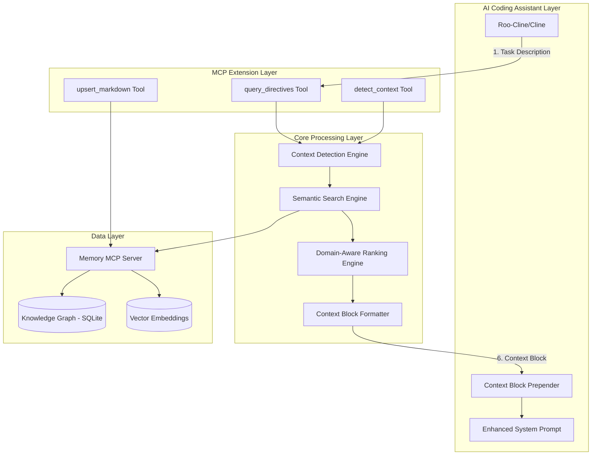
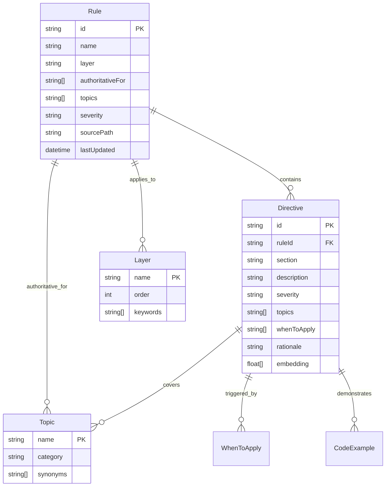

# Design Document: Knowledge Graph Memory for AI Coding Assistants

## Overview

The Knowledge Graph Memory system extends the open-source Memory MCP Server to provide intelligent, context-aware rule and directive retrieval for AI coding assistants. The system uses a three-layer architecture combining semantic search, domain-specific ranking, and intelligent context detection to surface only the most relevant project rules for each coding task.

**Core Value Proposition:**
- Reduce context tokens by 70-85% (from 5K-15K to 800-1.5K tokens)
- Improve directive relevance from 30-40% to 85-95%
- Provide sub-400ms query response times
- Enable automatic ingestion of markdown rule documents
- Cross-platform compatibility (Windows, macOS, Linux) via TypeScript/Node.js

## Architecture

### Embedding Strategy

The system leverages the Memory MCP Server's **configurable embedding system**:

**Options (in order of preference):**
1. **Memory MCP's configured embeddings** - Uses whatever the Memory MCP Server is configured for
2. **Local model integration (Phase 2)** - Optional Ollama/local model support for enhanced context detection
3. **Keyword-only fallback** - Pure rule-based matching if embeddings unavailable
4. **No external dependencies** - System works without any embedding service

**Configuration Examples:**
```json
// Memory MCP with OpenAI embeddings (optional)
{
  "embedding": {
    "provider": "openai",
    "model": "text-embedding-3-small"
  }
}

// Memory MCP with local embeddings (optional)  
{
  "embedding": {
    "provider": "local",
    "model": "sentence-transformers/all-MiniLM-L6-v2"
  }
}

// Memory MCP without embeddings (keyword-only)
{
  "embedding": {
    "provider": "none"
  }
}

// Phase 2: Local model for enhanced context detection (optional)
{
  "contextDetection": {
    "provider": "local",
    "endpoint": "http://localhost:11434/api/generate",
    "model": "llama3.2:3b",
    "timeout": 5000
  }
}
```

**Graceful Degradation**: If embeddings fail or are unavailable, the system automatically falls back to keyword-based search with no loss of core functionality.

### High-Level System Architecture



### Component Architecture

The system follows a layered architecture with clear separation of concerns:

1. **MCP Extension Layer**: Three new tools extending Memory MCP Server
2. **Core Processing Layer**: Business logic engines for detection, search, ranking
3. **Data Layer**: Memory MCP Server with SQLite graph database and vector embeddings

## Components and Interfaces

### 1. MCP Tool Extensions

#### A. query_directives Tool

**Primary Interface for AI Coding Assistants**

```typescript
interface QueryDirectivesRequest {
  taskDescription: string;           // Required: User's coding task
  modeSlug?: 'code' | 'architect' | 'debug';  // Optional: Execution mode
  options?: {
    strictLayer?: boolean;           // Enforce layer filtering
    maxItems?: number;              // Max directives (default: 8)
    tokenBudget?: number;           // Token limit (default: 900)
    includeBreadcrumbs?: boolean;   // Include source citations
  };
}

interface QueryDirectivesResponse {
  context_block: string;            // Formatted markdown for prompt
  citations: Citation[];            // Source references
  diagnostics: {
    detectedLayer: string;
    topics: string[];
    retrievalStats: {
      searched: number;
      considered: number;
      selected: number;
    };
    executionTimeMs: number;
    confidence: number;
  };
}
```

#### B. detect_context Tool

**Standalone Context Analysis**

```typescript
interface DetectContextRequest {
  text: string;                     // Task description to analyze
  options?: {
    returnKeywords?: boolean;       // Include extracted keywords
  };
}

interface DetectContextResponse {
  detectedLayer: string;            // Primary architectural layer
  topics: string[];                // Relevant domain topics
  keywords?: string[];             // Extracted keywords (if requested)
  confidence: number;              // Detection confidence (0.0-1.0)
  technologies?: string[];         // Detected tech stack
}
```

#### C. upsert_markdown Tool

**Rule Document Ingestion**

```typescript
interface UpsertMarkdownRequest {
  documents: Array<{
    path: string;                   // Relative path to markdown file
    content?: string;               // Optional: direct content
  }>;
  options?: {
    overwrite?: boolean;            // Replace existing rules
    validateOnly?: boolean;         // Parse but don't persist
  };
}

interface UpsertMarkdownResponse {
  upserted: {
    rules: number;
    sections: number;
    directives: number;
    patterns: number;
  };
  relations: number;
  warnings: string[];
  errors: string[];
  processingTimeMs: number;
}
```

### 2. Context Detection Engine

**Responsibility**: Analyze task descriptions to identify architectural context

**NLP Approach**: The system uses a **tiered approach** with graceful fallbacks:

**Phase 1 (Rule-Based)**:
- **No external NLP models required** - avoids dependencies on OpenAI, Hugging Face, etc.
- **Keyword matching** with predefined dictionaries for each domain
- **Pattern matching** using regex for layer detection
- **Simple text processing** using built-in JavaScript string methods and basic stemming

**Phase 2 (Enhanced with Local Models - Optional)**:
- **Local model integration** via HTTP API (Ollama, LocalAI, etc.)
- **Structured prompting** for better context detection and topic extraction
- **Cost-free enhancement** - no API costs, runs locally
- **Graceful fallback** to rule-based approach if local model unavailable

**Dependencies**:
- Memory MCP Server's embedding system (configurable - can use OpenAI, local models, or none)
- Optional: Local model server (Ollama, LocalAI, etc.) for enhanced accuracy
- No mandatory external API calls
- Lightweight approach suitable for local development environments

**Key Components:**

```typescript
class ContextDetectionEngine {
  private config: ContextDetectionConfig;
  
  constructor(config: ContextDetectionConfig) {
    this.config = config;
  }
  
  // Enhanced layer detection with optional local model
  async detectLayer(taskText: string): Promise<LayerDetectionResult> {
    // Try local model first if configured (Phase 2)
    if (this.config.localModel?.enabled) {
      try {
        return await this.detectLayerWithLocalModel(taskText);
      } catch (error) {
        console.warn('Local model detection failed, falling back to rule-based:', error.message);
      }
    }
    
    // Fallback to rule-based detection
    return this.detectLayerRuleBased(taskText);
  }
  
  // Rule-based layer detection (Phase 1)
  private detectLayerRuleBased(taskText: string): LayerDetectionResult {
    const patterns = {
      '1-Presentation': /\b(UI|component|page|view|CSS|React|form|button|style)\b/i,
      '2-Application': /\b(service|business|logic|workflow|orchestration|flow)\b/i,
      '3-Domain': /\b(entity|aggregate|value object|domain|model|rule)\b/i,
      '4-Persistence': /\b(database|repository|SQL|query|migration|table|DB)\b/i,
      '5-Tests': /\b(test|testing|unit|integration|E2E|coverage|mock)\b/i,
      '6-Docs': /\b(documentation|diagram|spec|README|guide)\b/i,
      '7-Deployment': /\b(deploy|infrastructure|CI\/CD|Docker|Azure|K8s)\b/i
    };
    
    // Score each layer and return highest confidence match
  }
  
  // Local model-enhanced detection (Phase 2)
  private async detectLayerWithLocalModel(taskText: string): Promise<LayerDetectionResult> {
    const prompt = this.buildContextDetectionPrompt(taskText);
    const response = await this.callLocalModel(prompt);
    return this.parseLocalModelResponse(response);
  }
  
  // Topic extraction using keyword matching and semantic similarity
  extractTopics(taskText: string): string[] {
    const topicDictionaries = {
      security: ['auth', 'validation', 'encrypt', 'token', 'permission'],
      api: ['endpoint', 'REST', 'GraphQL', 'HTTP', 'request'],
      performance: ['cache', 'optimize', 'index', 'scale', 'speed'],
      testing: ['test', 'mock', 'coverage', 'assert', 'verify']
    };
    
    // Primary approach: keyword matching with stemming and synonyms
    // Fallback: use existing Memory MCP embeddings for semantic similarity
    // No external NLP models required - leverages Memory MCP's embedding system
  }
  
  // Technology detection from explicit mentions
  detectTechnologies(taskText: string): string[] {
    // Pattern match for languages, frameworks, platforms
  }
  
  // Local model integration methods (Phase 2)
  private buildContextDetectionPrompt(taskText: string): string {
    return `Analyze this software development task and extract context information.

Task: "${taskText}"

Please respond with JSON in this exact format:
{
  "layer": "1-Presentation|2-Application|3-Domain|4-Persistence|5-Tests|6-Docs|7-Deployment",
  "topics": ["security", "api", "testing", "performance", ...],
  "technologies": ["React", "C#", "SQL", "Docker", ...],
  "confidence": 0.85
}

Layer definitions:
- 1-Presentation: UI components, pages, styling, user interface
- 2-Application: Business logic, services, workflows, orchestration  
- 3-Domain: Entities, domain models, business rules, aggregates
- 4-Persistence: Database, repositories, queries, data access
- 5-Tests: Unit tests, integration tests, test utilities
- 6-Docs: Documentation, diagrams, specifications
- 7-Deployment: Infrastructure, CI/CD, deployment, monitoring

Only return the JSON, no other text.`;
  }
  
  private async callLocalModel(prompt: string): Promise<any> {
    const { endpoint, model, timeout = 5000 } = this.config.localModel;
    
    const requestBody = {
      model: model,
      prompt: prompt,
      stream: false,
      options: {
        temperature: 0.1,  // Low temperature for consistent structured output
        top_p: 0.9,
        max_tokens: 200
      }
    };
    
    const controller = new AbortController();
    const timeoutId = setTimeout(() => controller.abort(), timeout);
    
    try {
      const response = await fetch(endpoint, {
        method: 'POST',
        headers: { 'Content-Type': 'application/json' },
        body: JSON.stringify(requestBody),
        signal: controller.signal
      });
      
      clearTimeout(timeoutId);
      
      if (!response.ok) {
        throw new Error(`Local model API error: ${response.status}`);
      }
      
      const data = await response.json();
      return data.response || data.text || data.content;
    } catch (error) {
      clearTimeout(timeoutId);
      throw error;
    }
  }
  
  private parseLocalModelResponse(response: string): LayerDetectionResult {
    try {
      // Extract JSON from response (handle cases where model adds extra text)
      const jsonMatch = response.match(/\{[\s\S]*\}/);
      if (!jsonMatch) {
        throw new Error('No JSON found in response');
      }
      
      const parsed = JSON.parse(jsonMatch[0]);
      
      return {
        layer: parsed.layer,
        topics: parsed.topics || [],
        technologies: parsed.technologies || [],
        confidence: parsed.confidence || 0.5,
        source: 'local-model'
      };
    } catch (error) {
      throw new Error(`Failed to parse local model response: ${error.message}`);
    }
  }
}
```

**Layer Detection Algorithm:**
1. **Pattern Matching**: Score task text against layer-specific regex patterns
2. **Keyword Weighting**: Weight matches by keyword importance and frequency  
3. **Context Clues**: Consider surrounding words for disambiguation using simple word proximity
4. **Confidence Scoring**: Return confidence based on match strength and ambiguity
5. **No External Models**: Uses rule-based approach with predefined patterns - no ML models required

### 3. Semantic Search Engine

**Responsibility**: Query knowledge graph using detected context and semantic similarity

**Key Components:**

```typescript
class SemanticSearchEngine {
  // Primary search method combining multiple strategies
  async searchDirectives(context: DetectedContext): Promise<Directive[]> {
    const candidates = await Promise.all([
      this.searchByLayer(context.layer),
      this.searchByTopics(context.topics),
      this.searchBySemanticSimilarity(context.taskText),
      this.searchByAuthorityRules(context.topics)
    ]);
    
    return this.deduplicateAndMerge(candidates);
  }
  
  // Layer-based filtering
  private async searchByLayer(layer: string): Promise<Directive[]> {
    return this.memoryMCP.searchNodes({
      query: `layer:${layer} OR layer:*`,
      nodeType: 'directive'
    });
  }
  
  // Topic-based search
  private async searchByTopics(topics: string[]): Promise<Directive[]> {
    const topicQueries = topics.map(topic => `topics:${topic}`);
    return this.memoryMCP.searchNodes({
      query: topicQueries.join(' OR '),
      nodeType: 'directive'
    });
  }
  
  // Vector similarity search (uses Memory MCP's embedding system)
  private async searchBySemanticSimilarity(taskText: string): Promise<Directive[]> {
    // Leverages Memory MCP Server's configurable embedding system
    // Can be OpenAI embeddings, local models, or disabled entirely
    try {
      const embedding = await this.memoryMCP.generateEmbedding(taskText);
      return this.memoryMCP.searchSimilar({
        embedding,
        nodeType: 'directive',
        limit: 50
      });
    } catch (error) {
      // Graceful fallback to keyword-only search if embeddings unavailable
      console.warn('Embeddings unavailable, falling back to keyword search');
      return [];
    }
  }
}
```

**Search Strategy:**
1. **Multi-Modal Search**: Combine layer, topic, authority, and semantic searches
2. **Candidate Aggregation**: Merge results from different search strategies
3. **Deduplication**: Remove duplicate directives while preserving highest scores
4. **Relevance Filtering**: Apply minimum relevance thresholds

### 4. Domain-Aware Ranking Engine

**Responsibility**: Score and rank candidate directives using domain-specific algorithm

**Ranking Algorithm Implementation:**

```typescript
class DomainAwareRankingEngine {
  rankDirectives(
    candidates: Directive[], 
    context: DetectedContext
  ): RankedDirective[] {
    return candidates
      .map(directive => ({
        directive,
        score: this.calculateScore(directive, context)
      }))
      .sort((a, b) => b.score - a.score);
  }
  
  private calculateScore(directive: Directive, context: DetectedContext): number {
    const weights = {
      authority: 10,
      whenToApply: 8,
      layerMatch: 7,
      topicOverlap: 5,
      severityBoost: 4,
      semanticSim: 3
    };
    
    return (
      this.calculateAuthority(directive, context) * weights.authority +
      this.calculateWhenToApply(directive, context) * weights.whenToApply +
      this.calculateLayerMatch(directive, context) * weights.layerMatch +
      this.calculateTopicOverlap(directive, context) * weights.topicOverlap +
      this.calculateSeverityBoost(directive) * weights.severityBoost +
      this.calculateSemanticSim(directive, context) * weights.semanticSim
    );
  }
  
  private calculateAuthority(directive: Directive, context: DetectedContext): number {
    const sourceRule = directive.sourceRule;
    const isAuthoritative = context.topics.some(topic => 
      sourceRule.authoritativeFor.includes(topic)
    );
    return isAuthoritative ? 1.0 : 0.0;
  }
  
  private calculateTopicOverlap(directive: Directive, context: DetectedContext): number {
    const intersection = directive.topics.filter(topic => 
      context.topics.includes(topic)
    );
    const union = [...new Set([...directive.topics, ...context.topics])];
    return intersection.length / union.length; // Jaccard similarity
  }
  
  // Additional scoring methods...
}
```

**Scoring Components:**
- **Authority (Weight: 10)**: Rule marked authoritative for detected topics
- **WhenToApply (Weight: 8)**: Directive conditions match task keywords  
- **LayerMatch (Weight: 7)**: Directive layer matches detected layer
- **TopicOverlap (Weight: 5)**: Jaccard similarity of topics
- **SeverityBoost (Weight: 4)**: MUST=3, SHOULD=2, MAY=1
- **SemanticSim (Weight: 3)**: Cosine similarity of embeddings

### 5. Context Block Formatter

**Responsibility**: Format ranked directives into consumable markdown within token budget

```typescript
class ContextBlockFormatter {
  formatContextBlock(
    rankedDirectives: RankedDirective[],
    context: DetectedContext,
    options: FormattingOptions
  ): string {
    let block = this.buildHeader(context);
    let tokenCount = this.estimateTokens(block);
    
    // Always include top 3 MUST directives
    const mustDirectives = rankedDirectives
      .filter(rd => rd.directive.severity === 'MUST')
      .slice(0, 3);
    
    for (const rankedDirective of mustDirectives) {
      const entry = this.formatDirective(rankedDirective, options);
      block += entry;
      tokenCount += this.estimateTokens(entry);
    }
    
    // Add remaining directives within budget
    const remainingDirectives = rankedDirectives
      .filter(rd => !mustDirectives.includes(rd));
    
    for (const rankedDirective of remainingDirectives) {
      const entry = this.formatDirective(rankedDirective, options);
      const entryTokens = this.estimateTokens(entry);
      
      if (tokenCount + entryTokens > options.tokenBudget) {
        break;
      }
      
      block += entry;
      tokenCount += entryTokens;
    }
    
    return block;
  }
  
  private formatDirective(
    rankedDirective: RankedDirective, 
    options: FormattingOptions
  ): string {
    const { directive } = rankedDirective;
    let entry = `\n- **[${directive.severity}]** ${directive.description}\n`;
    
    if (options.includeBreadcrumbs) {
      entry += `  - *Applies to: ${directive.topics.join(', ')}*\n`;
      entry += `  - *Source: ${directive.sourceRule.name} → ${directive.section}*\n`;
    }
    
    if (directive.rationale) {
      entry += `  - *Rationale: ${directive.rationale}*\n`;
    }
    
    return entry;
  }
  
  private estimateTokens(text: string): number {
    // Conservative estimation: 1 token ≈ 4 characters
    return Math.ceil(text.length / 4);
  }
}
```

**Formatting Strategy:**
1. **Header Generation**: Include detected context summary
2. **MUST Directive Priority**: Always include top 3 MUST directives
3. **Token Budget Management**: Stop adding when budget would be exceeded
4. **Breadcrumb Citations**: Optional source traceability
5. **Readable Structure**: Clear markdown hierarchy

## Data Models

### Core Entity Models

```typescript
// Rule document representation
interface Rule {
  id: string;
  name: string;
  layer: string;                    // 1-Presentation, 2-Application, etc.
  authoritativeFor: string[];       // Topics this rule is authoritative for
  topics: string[];                // All topics covered by this rule
  severity: 'MUST' | 'SHOULD' | 'MAY';
  whenToApply: string[];           // Conditions when rule applies
  sourcePath: string;              // Original markdown file path
  lastUpdated: Date;
  directives: Directive[];
}

// Individual directive within a rule
interface Directive {
  id: string;
  ruleId: string;
  section: string;                 // Section name within rule document
  description: string;             // Main directive text
  severity: 'MUST' | 'SHOULD' | 'MAY';
  topics: string[];               // Specific topics for this directive
  whenToApply: string[];          // When this directive applies
  rationale?: string;             // Why this directive exists
  examples?: CodeExample[];       // Code examples
  antiPatterns?: CodeExample[];   // What not to do
  embedding?: number[];           // Vector embedding for semantic search
}

// Code examples within directives
interface CodeExample {
  language: string;
  code: string;
  description?: string;
  isAntiPattern: boolean;
}

// Context detection results
interface DetectedContext {
  layer: string;
  topics: string[];
  keywords: string[];
  technologies: string[];
  confidence: number;
  taskText: string;
  source?: 'rule-based' | 'local-model';
}

// Configuration for context detection (Phase 2)
interface ContextDetectionConfig {
  localModel?: {
    enabled: boolean;
    endpoint: string;           // e.g., "http://localhost:11434/api/generate"
    model: string;             // e.g., "llama3.2:3b", "codellama:7b"
    timeout?: number;          // Request timeout in ms (default: 5000)
    fallbackToRules?: boolean; // Fallback to rule-based if model fails (default: true)
  };
  ruleBased: {
    enabled: boolean;          // Always true as fallback
    confidenceThreshold: number; // Minimum confidence for rule-based results
  };
}

// Ranked directive for response
interface RankedDirective {
  directive: Directive;
  score: number;
  scoreBreakdown: {
    authority: number;
    whenToApply: number;
    layerMatch: number;
    topicOverlap: number;
    severityBoost: number;
    semanticSim: number;
  };
}
```

### Graph Relationships



## Error Handling

### Error Categories and Responses

```typescript
enum ErrorType {
  VALIDATION_ERROR = 'VALIDATION_ERROR',
  GRAPH_EMPTY = 'GRAPH_EMPTY',
  CONTEXT_DETECTION_FAILED = 'CONTEXT_DETECTION_FAILED',
  SEARCH_TIMEOUT = 'SEARCH_TIMEOUT',
  EMBEDDING_FAILED = 'EMBEDDING_FAILED',
  DATABASE_ERROR = 'DATABASE_ERROR',
  INVALID_INPUT = 'INVALID_INPUT'
}

interface ErrorResponse {
  error: {
    type: ErrorType;
    message: string;
    details?: any;
    recoveryHint?: string;
  };
  fallbackData?: any;
}
```

### Error Handling Strategies

1. **Graceful Degradation**:
   - If embeddings fail → fall back to keyword search
   - If context detection fails → use generic context
   - If graph is empty → return helpful setup message

2. **Partial Results**:
   - Return partial results with warnings when possible
   - Include diagnostic information about what failed

3. **Recovery Hints**:
   - Provide actionable guidance for resolving errors
   - Include links to documentation or setup guides

4. **Fallback Rules**:
   - Maintain minimal core rules for emergency fallback
   - Ensure AI assistants can continue working with basic context

### Example Error Responses

```typescript
// Empty graph error
{
  error: {
    type: 'GRAPH_EMPTY',
    message: 'Knowledge graph contains no rules',
    recoveryHint: 'Use memory.rules.upsert_markdown to ingest rule documents'
  }
}

// Low confidence warning
{
  context_block: "...",
  diagnostics: {
    confidence: 0.4,
    warnings: ['Low confidence context detection. Results may be less relevant.']
  }
}

// Embedding failure with fallback
{
  context_block: "...",
  diagnostics: {
    warnings: ['Vector embeddings unavailable. Using keyword-based search.']
  }
}
```

## Testing Strategy

### Unit Testing

**Context Detection Engine Tests:**
```typescript
describe('ContextDetectionEngine', () => {
  describe('Rule-based detection', () => {
    test('detects presentation layer for UI tasks', async () => {
      const engine = new ContextDetectionEngine({ ruleBased: { enabled: true, confidenceThreshold: 0.5 } });
      const result = await engine.detectLayer('Add a login button to the header');
      expect(result.layer).toBe('1-Presentation');
      expect(result.confidence).toBeGreaterThan(0.8);
      expect(result.source).toBe('rule-based');
    });
    
    test('extracts security topics from auth tasks', async () => {
      const result = await engine.extractTopics('Implement user authentication');
      expect(result.topics).toContain('security');
      expect(result.topics).toContain('authentication');
    });
  });
  
  describe('Local model detection (Phase 2)', () => {
    test('uses local model when available', async () => {
      const mockLocalModel = jest.fn().mockResolvedValue({
        layer: '4-Persistence',
        topics: ['security', 'api', 'database'],
        confidence: 0.92
      });
      
      const engine = new ContextDetectionEngine({
        localModel: { 
          enabled: true, 
          endpoint: 'http://localhost:11434/api/generate',
          model: 'llama3.2:3b'
        }
      });
      
      const result = await engine.detectLayer('Add user registration API endpoint');
      expect(result.source).toBe('local-model');
      expect(result.confidence).toBeGreaterThan(0.9);
    });
    
    test('falls back to rule-based when local model fails', async () => {
      const engine = new ContextDetectionEngine({
        localModel: { 
          enabled: true, 
          endpoint: 'http://localhost:11434/api/generate',
          model: 'unavailable-model'
        }
      });
      
      // Mock network failure
      jest.spyOn(global, 'fetch').mockRejectedValue(new Error('Connection refused'));
      
      const result = await engine.detectLayer('Add a login button');
      expect(result.source).toBe('rule-based');
      expect(result.layer).toBe('1-Presentation');
    });
  });
});
```

**Ranking Engine Tests:**
```typescript
describe('DomainAwareRankingEngine', () => {
  test('prioritizes MUST directives over SHOULD', () => {
    const mustDirective = createDirective({ severity: 'MUST' });
    const shouldDirective = createDirective({ severity: 'SHOULD' });
    
    const ranked = engine.rankDirectives([shouldDirective, mustDirective], context);
    
    expect(ranked[0].directive).toBe(mustDirective);
  });
  
  test('scores authoritative rules higher', () => {
    const authRule = createDirective({ 
      sourceRule: { authoritativeFor: ['security'] }
    });
    const nonAuthRule = createDirective({ 
      sourceRule: { authoritativeFor: ['testing'] }
    });
    
    const context = { topics: ['security'] };
    const ranked = engine.rankDirectives([nonAuthRule, authRule], context);
    
    expect(ranked[0].directive).toBe(authRule);
  });
});
```

### Integration Testing

**End-to-End Query Flow:**
```typescript
describe('query_directives Integration', () => {
  test('complete flow from task to context block', async () => {
    // Setup: Ingest sample rules
    await upsertTool.execute({
      documents: [{ path: 'test/fixtures/security-rules.md' }]
    });
    
    // Execute: Query for security-related task
    const result = await queryTool.execute({
      taskDescription: 'Add user registration API endpoint',
      options: { maxItems: 5 }
    });
    
    // Verify: Context block contains relevant security directives
    expect(result.context_block).toContain('[MUST]');
    expect(result.context_block).toContain('Validate all inputs');
    expect(result.diagnostics.detectedLayer).toBe('4-Persistence');
    expect(result.diagnostics.topics).toContain('security');
  });
});
```

### Performance Testing

**Load Testing:**
```typescript
describe('Performance Tests', () => {
  test('query_directives completes within 400ms', async () => {
    const startTime = Date.now();
    
    await queryTool.execute({
      taskDescription: 'Create user profile update endpoint'
    });
    
    const duration = Date.now() - startTime;
    expect(duration).toBeLessThan(400);
  });
  
  test('handles 500+ rules without degradation', async () => {
    // Ingest 500 test rules
    await ingestLargeRuleSet();
    
    const startTime = Date.now();
    await queryTool.execute({ taskDescription: 'Add API endpoint' });
    const duration = Date.now() - startTime;
    
    expect(duration).toBeLessThan(400);
  });
});
```

### Test Data Management

**Fixture Rules:**
- Create comprehensive test rule documents covering all layers
- Include edge cases: malformed rules, missing metadata, complex relationships
- Maintain realistic rule complexity and size

**Mock Data:**
- Mock Memory MCP Server responses for isolated unit testing
- Create deterministic test embeddings for consistent results
- Mock external dependencies (file system, network)

## Security Considerations

### Input Validation

1. **Path Traversal Prevention**:
   ```typescript
   import path from 'path';
   
   function validatePath(inputPath: string): boolean {
     const normalizedPath = path.normalize(inputPath);
     const resolvedPath = path.resolve(normalizedPath);
     const basePath = path.resolve('.');
     
     // Ensure path is within project directory and doesn't contain traversal
     return resolvedPath.startsWith(basePath) && 
            !normalizedPath.includes('..') &&
            normalizedPath.match(/^[a-zA-Z0-9._/\\-]+$/); // Allow both / and \ for cross-platform
   }
   ```

2. **SQL Injection Prevention**:
   - Use parameterized queries exclusively
   - Validate all input before database operations
   - Sanitize user-provided search terms

3. **Content Sanitization**:
   ```typescript
   function sanitizeForLogging(content: string): string {
     return content
       .replace(/\b[A-Za-z0-9._%+-]+@[A-Za-z0-9.-]+\.[A-Z|a-z]{2,}\b/g, '[EMAIL]')
       .replace(/\b(?:sk-|pk_|rk_)[A-Za-z0-9]{20,}\b/g, '[API_KEY]')
       .replace(/\b[A-Fa-f0-9]{32,}\b/g, '[TOKEN]');
   }
   ```

### Data Protection

1. **Secrets Detection**:
   - Scan rule documents for potential secrets during ingestion
   - Flag suspicious patterns (API keys, tokens, passwords)
   - Provide warnings without blocking ingestion

2. **Access Control**:
   - File system permissions: owner read/write only (Unix/Linux/macOS) or equivalent Windows ACLs
   - Database access: local SQLite with appropriate permissions
   - No network exposure of internal APIs
   - Cross-platform file path handling using Node.js path utilities

3. **Audit Logging**:
   - Log all rule modifications with timestamps
   - Track query patterns for security monitoring
   - Sanitize all logged content

### Threat Mitigation

| Threat | Mitigation |
|--------|------------|
| **Malicious rule injection** | Input validation, content scanning, manual review process |
| **Path traversal attacks** | Strict path validation, sandboxed file access |
| **SQL injection** | Parameterized queries, input sanitization |
| **Information disclosure** | Content sanitization, secure logging practices |
| **Denial of service** | Rate limiting, query timeouts, resource monitoring |

## Performance Optimization

### Caching Strategy

```typescript
class CacheManager {
  private contextCache = new Map<string, DetectedContext>();
  private searchCache = new Map<string, Directive[]>();
  
  // Cache context detection results for 5 minutes
  getCachedContext(taskText: string): DetectedContext | null {
    const key = this.hashText(taskText);
    const cached = this.contextCache.get(key);
    
    if (cached && Date.now() - cached.timestamp < 300000) {
      return cached;
    }
    
    return null;
  }
  
  // Cache search results for frequently queried contexts
  getCachedSearch(contextKey: string): Directive[] | null {
    return this.searchCache.get(contextKey);
  }
}
```

### Database Optimization

1. **Indexing Strategy**:
   ```sql
   CREATE INDEX idx_directive_topics ON directives(topics);
   CREATE INDEX idx_directive_layer ON directives(layer);
   CREATE INDEX idx_directive_severity ON directives(severity);
   CREATE INDEX idx_rule_authoritative ON rules(authoritativeFor);
   ```

2. **Query Optimization**:
   - Use prepared statements for repeated queries
   - Implement query result pagination for large result sets
   - Optimize vector similarity search with approximate algorithms

3. **Memory Management**:
   - Lazy load embeddings only when needed
   - Implement LRU cache for frequently accessed directives
   - Stream large result sets instead of loading all into memory

### Monitoring and Metrics

```typescript
interface PerformanceMetrics {
  queryLatency: {
    p50: number;
    p95: number;
    p99: number;
  };
  cacheHitRate: number;
  databaseQueryTime: number;
  embeddingGenerationTime: number;
  contextDetectionTime: number;
  rankingTime: number;
}
```

**Key Performance Indicators:**
- Query latency (target: <400ms P95)
- Cache hit rate (target: >60%)
- Database query time (target: <100ms)
- Memory usage (target: <500MB for 500+ rules)
- Concurrent request handling (target: 10+ simultaneous)

This design provides a comprehensive foundation for implementing the Knowledge Graph Memory system with clear architectural boundaries, robust error handling, and performance optimization strategies.